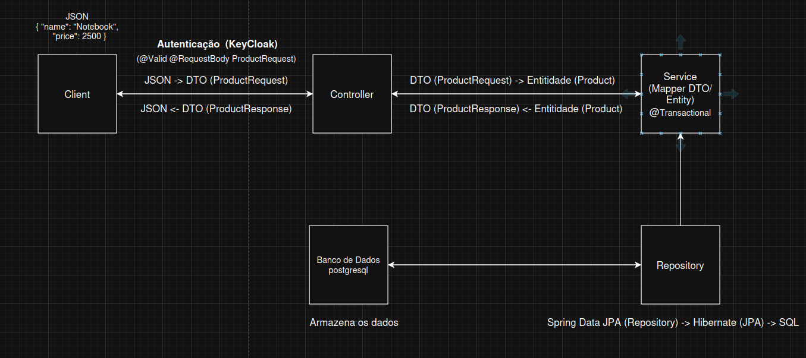

### 1. Visão geral



Este repositório contém uma **API REST** desenvolvida em **Spring Boot 3** para realizar operações de CRUD de **Produtos** (`Product`).
A aplicação utiliza:

* **Spring Web** (endpoints REST)
* **Spring Data JPA + Hibernate** (persistência)
* **PostgreSQL** (banco de dados)
* **Flyway** (migrações de schema)
* **Spring Security + OAuth2 Resource Server (JWT)** (autenticação)
* **Springdoc OpenAPI** (Swagger UI / documentação de API)

A aplicação roda na porta **8081** por padrão.

---

### 2. Arquitetura e responsabilidades

A estrutura segue o padrão em camadas:

* **Controller**

  * Recebe requisições HTTP.
  * Valida entradas (`@Valid`).
  * Retorna respostas HTTP (`ResponseEntity`).

* **Service**

  * Centraliza regras e orquestração.
  * Faz mapeamento **DTO ↔ Entidade**.
  * Controla transações (`@Transactional`).

* **Repository**

  * Interface `JpaRepository` para acesso ao banco.
  * Operações de persistência e consulta.

* **DTOs**

  * `ProductRequest`: entrada (JSON → DTO) com validações.
  * `ProductResponse`: saída (DTO → JSON).

* **Entidade**

  * `Product`: entidade JPA persistida em `products`.

---

### 3. Persistência e migrações (Flyway)

* O schema do banco é gerenciado via **Flyway**.
* Migração inicial:

  * `src/main/resources/db/migration/V1__create_products_table.sql`
  * Cria a tabela `products` com `id`, `name` e `price`.

Configuração relevante:

* `spring.jpa.hibernate.ddl-auto: validate`
  O Hibernate **não cria** tabelas automaticamente; ele valida se o schema existe e está consistente. As tabelas devem ser criadas via Flyway.

---

### 4. Autenticação e autorização (JWT / Keycloak)

A API está configurada como **Resource Server** e exige **JWT válido** na maioria das rotas.

#### 4.1 Rotas públicas (sem autenticação)

Liberadas em `SecurityConfig`:

* `GET /health`
* Swagger/OpenAPI:

  * `/swagger-ui.html`
  * `/swagger-ui/**`
  * `/v3/api-docs/**`

#### 4.2 Rotas protegidas (exigem JWT)

* Todas as demais rotas exigem:

  * Header: `Authorization: Bearer <token>`

#### 4.3 Emissor do token (issuer)

Em `application.yml`:

* `spring.security.oauth2.resourceserver.jwt.issuer-uri: http://localhost:8080/realms/crud-java`

Isso significa que o token precisa:

* Ser emitido por um realm **crud-java** em um Keycloak local na porta **8080**
* Conter os metadados compatíveis com o issuer (OpenID Provider Configuration)

#### 4.4 Swagger com autenticação

Existe um esquema de segurança definido:

* `OpenApiConfig` cria um `SecurityScheme` Bearer/JWT.
* `ProductController` exige `@SecurityRequirement(name = "Authorize")`.
  No Swagger UI, você deve informar o token JWT no botão **Authorize**.

---

### 5. Endpoints disponíveis

Base path: `/api/products`

#### 5.1 Buscar produto por ID

* `GET /api/products/{id}`
* Resposta: `200 OK` com `ProductResponse`

#### 5.2 Criar produto

* `POST /api/products`
* Body (`ProductRequest`):

  * `name` (obrigatório, não vazio)
  * `price` (obrigatório, mínimo 0)
* Resposta:

  * `201 Created`
  * Header `Location: /api/products/{id}`
  * Body com `ProductResponse`

#### 5.3 Atualizar produto

* `PUT /api/products/{id}`
* Resposta: `200 OK` com `ProductResponse`

#### 5.4 Remover produto

* `DELETE /api/products/{id}`
* Resposta: `204 No Content`

Observação: não há endpoint de listagem (`GET /api/products`) neste repositório.

---

### 6. Validação de entrada

O DTO `ProductRequest` aplica validações:

* `name`: `@NotBlank`
* `price`: `@NotNull` e `@Min(0)`

Entradas inválidas devem resultar em erro 4xx (tipicamente `400 Bad Request`) conforme o comportamento padrão do Spring Validation.

---

### 7. Containers (Docker Compose)

O projeto fornece `docker-compose.yml` e `.env` em `src/`:

* `src/docker-compose.yml`
* `src/.env`

Ele sobe:

1. **PostgreSQL** da aplicação (porta padrão **5432**)
2. **PostgreSQL** do Keycloak (porta padrão **5433**)
3. **Keycloak** (porta **8080**)

Variáveis principais (em `src/.env`):

* Banco da aplicação: `CRUD_DB_NAME`, `CRUD_DB_USER`, `CRUD_DB_PASSWORD`, `CRUD_DB_PORT`
* Banco do Keycloak: `KC_DB_*`, `KC_DB_PORT`, `KC_JDBC_URL`
* Admin do Keycloak: `KEYCLOAK_ADMIN`, `KEYCLOAK_ADMIN_PASSWORD`, `KEYCLOAK_PORT`
* Realm esperado: `KEYCLOAK_REALM=crud-java`

#### 7.1 Subir a infraestrutura

A partir da raiz do repositório:

```bash
docker compose --env-file src/.env -f src/docker-compose.yml up -d
```

Isso disponibiliza:

* PostgreSQL (app): `localhost:5432`
* Keycloak: `http://localhost:8080`

---

### 8. Executando a aplicação

#### 8.1 Requisitos

* **Java 17** (toolchain configurada no Gradle)
* Docker (opcional, mas recomendado para subir Postgres/Keycloak)

#### 8.2 Subir a API

Na raiz do projeto:

```bash
./gradlew bootRun
```

Porta padrão da API:

* `http://localhost:8081`

Healthcheck:

* `GET http://localhost:8081/health`

Swagger UI:

* `http://localhost:8081/swagger-ui.html`

---

### 9. Configuração do Keycloak (necessária para autenticação)

Este repositório **não inclui** export/import de realm (não há arquivo JSON de realm). Portanto, para autenticar chamadas, é necessário configurar manualmente no Keycloak:

Configuração mínima esperada:

1. Criar o realm: **crud-java**
2. Criar um client para a API (ex.: `crud-java-api`)
3. Garantir emissão de JWT compatível com:

   * issuer: `http://localhost:8080/realms/crud-java`
4. Criar um usuário para testes e obter um token (via fluxo apropriado do client)

Depois, usar o JWT em:

* `Authorization: Bearer <token>`
